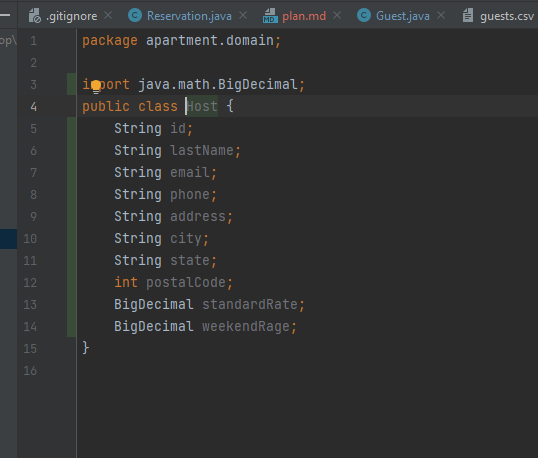

Notes: On the project:

GUEST HAS A DATE RANGE:

User: ACCOMMODATION ADMINISTRATOR:

TASKS THAT WANT TO BE DONE:
VIEW RESERVATIONS FOR A HOST:

CREATE RESERVATION FOR A GUEST WITH HOST.

EDIT EXISTING RESERVATIONS:

CANCEL FUTURE RESERVATION:

Use the following to create Models for Host, Guest, Reservation.

Guest Data:

Guest id, first name, last name, email, phone, state

Host Data:
id, lastname, email, phone, address, city, st, postal_code, standard rate, weekend rate

Reservation:
Id, start date, end date, guest id total

Reservation file id.txt, is the host id.

DATA LAYER:

GOING TO NEED 3 REPO MOST LIKELY. ONE FOR RESERVATION DATA, GUEST DATA, AND HOST DATA.

SERVICE LAYER:
GOING TO NEED 3 SERVICES IN THE DOMAIN LAYER. ONE FOR RESERVATION, GUEST, AND HOST.

CONTROLLER: WILL HAVE TO PASS UTILIZES THE 3 SERVICES TO GET THE NECCESSARY DATA PASSED IN.

View Reservations for Host:

User has multiple ways of selecting a host. Look up by unique id, search, or selection from list.

If host or host has no reservation not found, return a message letting the user know.

During this step of the process most likely will have to deal with the host service to get the host information.

Make Reservation:
User has multiple ways of selecting a host and guest. Look up by unique id, search, or selection from list.

Once a guest and host are chosen.

Need to present future reservation to user so user can select reservations date that don't collide.

EDIT:
search for reservation.
Prompt user twice
valid search results.
Display positive or error messages.

And do your changes.

Cancel:

Prompt user twice for strings.
Do search results.

Positive / error cases.

if no error, then remove user. If there's error display message.

Deliverables:

Each repo should take 2-4 hours to build and test successfully. (There are 3 repos)

Each services should take 2-4 to build and test successfully. (There are 3 services)

The UI layer should take 3-5 hours. UI will take awhile because controller logic will deal with utilizing
multiple services. 
